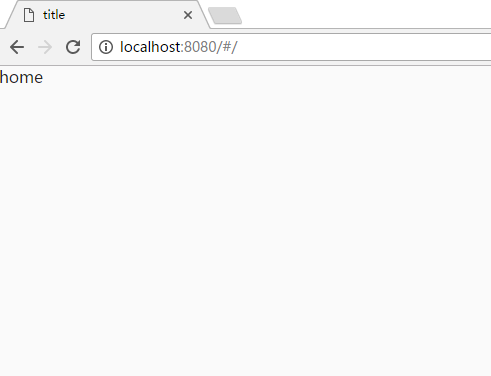

# 从零开始 ```angular1.x es6 webpack2 component```

## 工具说明
- package管理使用的是 ```yarn```，可以将源指向阿里云 ```npm``` 镜像解决下载包慢的问题
- 打包工具使用 ```webpack2```


## Getting Start

### Step 1：初始化项目
使用 ```yarn init``` 命令初始化项目
```cmd
$ yarn init
yarn init v0.21.3
question name (goblin-gaboratory):
question version (1.0.0): 0.0.1
question description: 从零开始 angular1.x webpack component
question entry point (index.js):
question repository url (https://github.com/gtUserName/goblin-gaboratory.git):
question author (song <song.dxs@gmail.com>):
question license (MIT):
success Saved package.json
Done in 37.48s.

```
生成 ```package.json``` 文件：
```json
{
  "name": "goblin-gaboratory",
  "version": "0.0.1",
  "description": "从零开始 angular1.x webpack component",
  "main": "index.js",
  "repository": "https://github.com/gtUserName/goblin-gaboratory.git",
  "author": "song <song.dxs@gmail.com>",
  "license": "MIT"
}
```


### Step 2：初始化项目配置
1. 初始化 ```git``` 配置  
根目录下创建 ```.gitignore``` 文件，增加以下内容
```
node_modules/
.*
```
2. 安装 ```webpack```  
命令行输入
```
yarn add webpack --dev
```
3. 初始化 ```webpack``` 配置  
根目录下增加 ```webpack.config.js``` 文件
```js
const path = require('path');
const webpack = require('webpack');

module.exports = {
  devtool: 'source-map',
  entry: {
    app: './src/app/app.js',
  },
  output: {
    filename: '[name].bundle.js',
    path: path.resolve(__dirname, './dist')
  }
};
```
5. add angular  
由于后续要配合 ```angular-material``` 使用，所以指定使用 ```angular@1.5.5``` 版本
```
yarn add angular@1.5.5 angular-animate@1.5.5  angular-aria@1.5.5 angular-messages@1.5.5 angular-material
```
6. 入口文件
```js
// src/app/app.js
import angular from 'angular';
console.log("Hello world!");
```
5. 运行 Hello world
```cmd
$ ./node_modules/.bin/webpack
Hash: 8ddfacc88a2d4c3cb1be
Version: webpack 2.2.1
Time: 887ms
            Asset     Size  Chunks                    Chunk Names
    app.bundle.js  1.15 MB       0  [emitted]  [big]  app
app.bundle.js.map  1.37 MB       0  [emitted]         app
   [0] ./~/angular/index.js 48 bytes {0} [built]
   [1] ./~/angular/angular.js 1.15 MB {0} [built]
   [2] ./src/app/app.js 62 bytes {0} [built]

```

### Step 3：完善 webpack 配置
1. 配置完成的 webpack.config.js 文件如下：
```js
const path = require('path');
const webpack = require('webpack');
const ExtractTextPlugin = require('extract-text-webpack-plugin');
const HtmlWebpackPlugin = require('html-webpack-plugin');

module.exports = {
  devtool: 'source-map',
  context: path.resolve(__dirname, './src'),  // The base directory (absolute path!)
  entry: {
    // 将第三方库打成一个包
    vendor: [
      'angular',
      'angular-animate',
      'angular-aria',
      'angular-messages',
      'angular-ui-router',
      'angular-material'
    ],
    // app 入口文件
    app: 'app/app.js',
  },
  output: {
    filename: '[name].bundle.js',
    path: path.resolve(__dirname, './dist'),
    publicPath: '', // webpack-dev-server配置，引用文件时使用的地址
  },
  devServer: {
    contentBase: path.resolve(__dirname, './src'),  // webpack-dev-server配置
  },
  resolve: {
    modules: [path.resolve(__dirname, './src'), 'node_modules'], //import 文件默认先从src目录找，没有再去node_modules，减少import src目录文件层级
    extensions: ['.js', '.css'],  // import js和css 文件时不需要写文件后缀名
  },
  module: {
    rules: [{
      test: /\.js$/,
      exclude: [/node_modules/],
      use: [{
        loader: 'babel-loader',   // 处理js文件，将ES6代码转换成ES5
        options: { presets: ['es2015'] }
      }]
    }, {
      test: /\.css$/,   // 处理css文件，增加css loader后可以直接在js文件中import css文件，加载的时候会将样式通过style element的形式增加到dom树中
      use: [
        'style-loader',
        {
          loader: 'css-loader',
          options: { modules: true }
        },
      ],
    }, {
      test: /\.(png|jpg)$/, // 将小的图pain处理成base64编码的方式，减少网页请求（暂未实测）
      use: [
        'url-loader?limit=8192'
      ],
    }, 
    // {
    //  test: /\.scss$/,  // 处理scss文件，在js文件中可以直接import
    //  use: [{
    //    loader: "style-loader" // creates style nodes from JS strings
    //  }, {
    //    loader: "css-loader" // translates CSS into CommonJS
    //  }, {
    //    loader: "sass-loader" // compiles Sass to CSS
    //  }]
    //}, 
    {
      test: /\.html$/,  // 处理html文件，在js文件中直接import angular template文件
      use: [
        'raw-loader'
      ]
    }],
  },
  plugins: [
    // 提取公共代码
    new webpack.optimize.CommonsChunkPlugin({
      names: ['vendor', 'commons'],
    }),
    // 压缩代码，目前有问题，开启压缩就是出错
    // new webpack.optimize.UglifyJsPlugin(),
    // 提取公共css
    new ExtractTextPlugin({
      filename: '[name].bundle.css',
      allChunks: true,
    }),
    // 根据模板自动生成html文件
    new HtmlWebpackPlugin({ template: 'index.html' })
  ]
};
```

2. 模板文件
```src/index.html```
```html
<!doctype html>
<html class="no-js" lang="">

<head>
  <meta charset="utf-8">
  <meta http-equiv="x-ua-compatible" content="ie=edge">
  <title>title</title>
  <meta name="description" content="">
  <meta name="viewport" content="width=device-width, initial-scale=1">

  <link rel="apple-touch-icon" href="apple-touch-icon.png">
  <!-- Place favicon.ico in the root directory -->

  <!--<link rel="stylesheet" href="css/normalize.css">
  <link rel="stylesheet" href="css/main.css">
  <script src="js/vendor/modernizr-2.8.3.min.js"></script>-->
</head>

<body ng-app="app" ng-cloak>
  <!--[if lte IE 9]>
      <p class="browserupgrade">You are using an <strong>outdated</strong> browser. Please <a href="http://browsehappy.com/">upgrade your browser</a> to improve your experience and security.</p>
  <![endif]-->

  <!-- Add your site or application content here -->
  <app>
    Loading...
  </app>

  <!--<script src="https://code.jquery.com/jquery-{{JQUERY_VERSION}}.min.js" integrity="{{JQUERY_SRI_HASH}}" crossorigin="anonymous"></script>
  <script>
    window.jQuery || document.write('<script src="js/vendor/jquery-{{JQUERY_VERSION}}.min.js"><\/script>')
  </script>-->
  <!--<script src="js/plugins.js"></script>
  <script src="js/main.js"></script>-->

  <!-- Google Analytics: change UA-XXXXX-Y to be your site's ID. -->
  <!--<script>
    window.ga = function () { ga.q.push(arguments) }; ga.q = []; ga.l = +new Date;
    ga('create', 'UA-XXXXX-Y', 'auto'); ga('send', 'pageview')
  </script>-->
  <!--<script src="https://www.google-analytics.com/analytics.js" async defer></script>-->
</body>

</html>

```
参考资料
* [html5-boilerplate](https://github.com/h5bp/html5-boilerplate/blob/master/src/index.html)

3. 安装依赖的包  
```
yarn add babel-core babel-loader babel-preset-es2015 css-loader extract-text-webpack-plugin html-webpack-plugin raw-loader style-loader url-loader webpack-dev-server --dev
```
生成的package.json如下
```json
{
  "name": "goblin-gaboratory",
  "version": "0.0.5",
  "description": "从零开始 angular1.x es6 webpack2 component",
  "main": "index.js",
  "repository": "https://github.com/gtUserName/goblin-gaboratory.git",
  "author": "xiaosong <song.dxs@gmail.com>",
  "license": "MIT",
  "devDependencies": {
    "babel-core": "^6.24.0",
    "babel-loader": "^6.4.1",
    "babel-preset-es2015": "^6.24.0",
    "css-loader": "^0.27.3",
    "extract-text-webpack-plugin": "^2.1.0",
    "html-webpack-plugin": "^2.28.0",
    "raw-loader": "^0.5.1",
    "style-loader": "^0.14.1",
    "url-loader": "^0.5.8",
    "webpack": "^2.2.1",
    "webpack-dev-server": "^2.4.2"
  },
  "dependencies": {
    "angular": "1.5.5",
    "angular-animate": "1.5.5",
    "angular-aria": "1.5.5",
    "angular-material": "^1.1.3",
    "angular-messages": "1.5.5"
  }
}
```
*```node-sass``` 使用 ```yarn``` 经常会失败，将sass相关部分注释掉了*

### Step4: ui-router
angular component配合ui-router使用需要使用1.0.0版本，0.4.x版本的ui-router无法正常工作
```
yarn add angular-ui-router@1.0.0
```

### Step5：demo代码
*demo代码说明待补充*  
参考资料
* [Angular 1.x和ES6的结合](https://github.com/xufei/blog/issues/29)
* [AngularClass/NG6-starter](https://github.com/AngularClass/NG6-starter)

### Step6：demo
webpack-dev-server启动调试server
```
./node_modules/.bin/webpack-dev-server
```
访问 ```http://localhost:8080/#/```  


### Step7：快速创建component
1. 安装 gulp, gulp-rename, gulp-template
```
yarn add --dev gulp gulp-rename gulp-template
```
2. 根目录下创建gulpfile.js文件
```js
const gulp     = require('gulp');
const path     = require('path');
const rename   = require('gulp-rename');
const template = require('gulp-template');
const yargs    = require('yargs');

gulp.task('component', () => {
  const cap = (val) => {
    return val.charAt(0).toUpperCase() + val.slice(1);
  };
  const name = yargs.argv.name;
  const parentPath = yargs.argv.parent || '';
  const destPath = path.join('src/app/components', parentPath, name);
  const blankTemplates = path.join(__dirname, 'generator', 'component/**/*.**');

  return gulp.src(blankTemplates)
    .pipe(template({
      name: name,
      upCaseName: cap(name)
    }))
    .pipe(rename((path) => {
      path.basename = path.basename.replace('temp', name);
    }))
    .pipe(gulp.dest(destPath));
});
```
3. component 模板文件
*待补充*
4. 测试
- 生成一级组件
```
./node_modules/.bin/gulp component --name test
```
生成的 component在 "src/app/components/test" 目录

- 生成子component方法
```
./node_modules/.bin/gulp component --name test --parent test
```

参考资料
* [AngularClass/NG6-starter](https://github.com/AngularClass/NG6-starter)


# TODO:
- 自动生成模块
- 代码压缩
- vendor
- 完整的demo页面
- node-sass安装失败

参考资料
* [UltimateAngular/ultimate-angular-master-seed](https://github.com/UltimateAngular/ultimate-angular-master-seed)
